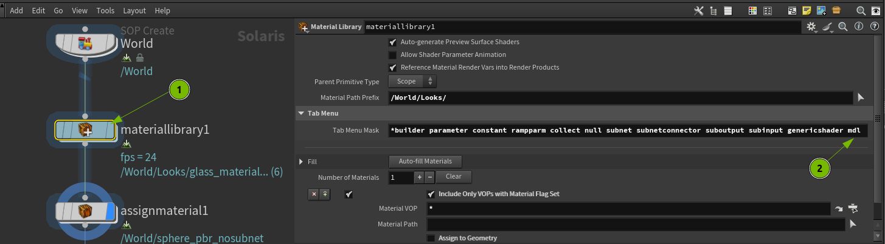
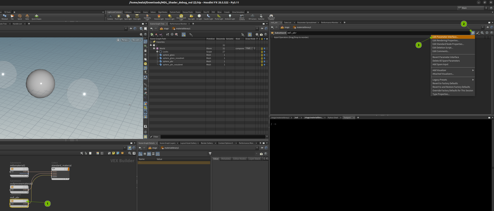
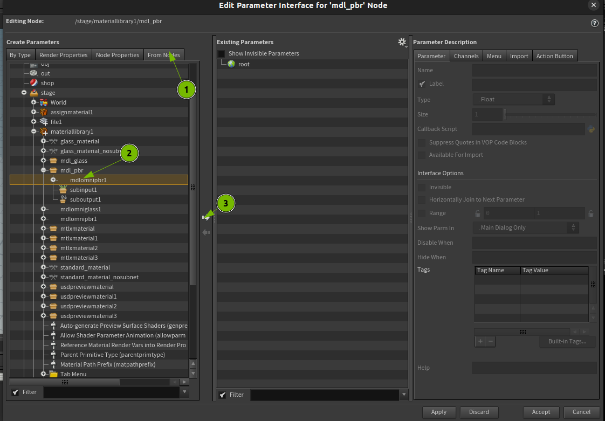
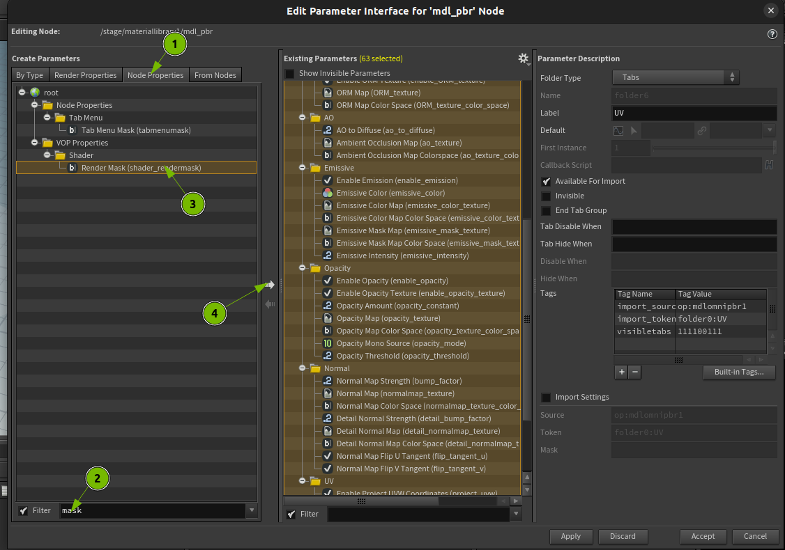
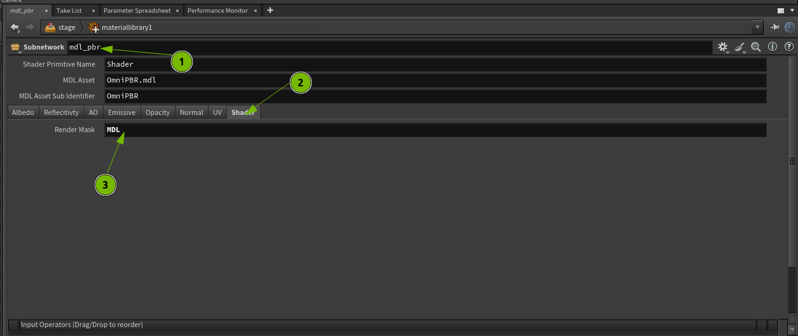
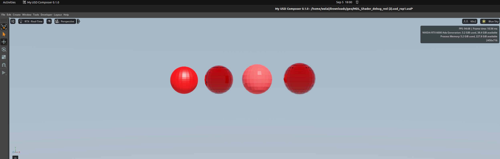

# Accessing Omni MDL VOPs in Material Library LOP

The **Material Library LOP** automatically filters some VOPs from its tab menu.  
If you find that the **Omni MDL VOPs** are missing from the tab menu inside a Material Library LOP node, follow these steps:

## Steps
1. Select the **Material Library LOP** node.
2. Add `mdl` at the end of the **Tab Menu Mask** parameter.

# Authoring MDL Shader in a Subnet VOP

When building an **MDL shader** within a **Subnet VOP**, it is required to promote all parameters of the Omni MDL VOP node inside the subnet to the subnet's spare parameters.  

## Steps

### 1. Promote all parameters from the MDL shader to the subnet
1. Select the **subnet**.
2. Click the **gear icon** on the Parameter Pane.
3. Select **Edit Parameter Interface**.

---

### 2. In the "Edit Parameter Interface" Dialog
1. Select the **From Nodes** tab. Expand the subnet node you are editing.
2. Select the **MDL shader node** inside the subnet.
3. Click the **:arrow_right:** icon to promote all parameters from the MDL shader to the subnet node.

---

### 3. Add the Render Mask parameter
Still in the "Edit Parameter Interface" dialog:
1. Select the **Node Properties** tab.
2. Filter by the word `mask`.
3. Select **Render Mask**.
4. Click the **:arrow_right:** icon to add the Render Mask parameter to the subnet node.
Finally, Click **Apply** to accept the changes and close the dialog.

---

### 4. Configure the Subnet node
1. Select the **Subnet** node. You should now see it has many parameters, all linked to the MDL shader node inside.
2. Go to the **Shader** tab.
3. Type `MDL` in the **Render Mask** parameter.

---

## Notes
- These steps must be repeated for **all subnets** that contain an MDL node producing a shader in materials.
- Once complete, the **Export USD** will have the correct shader connections to the material and will be rendered properly by RTX.

